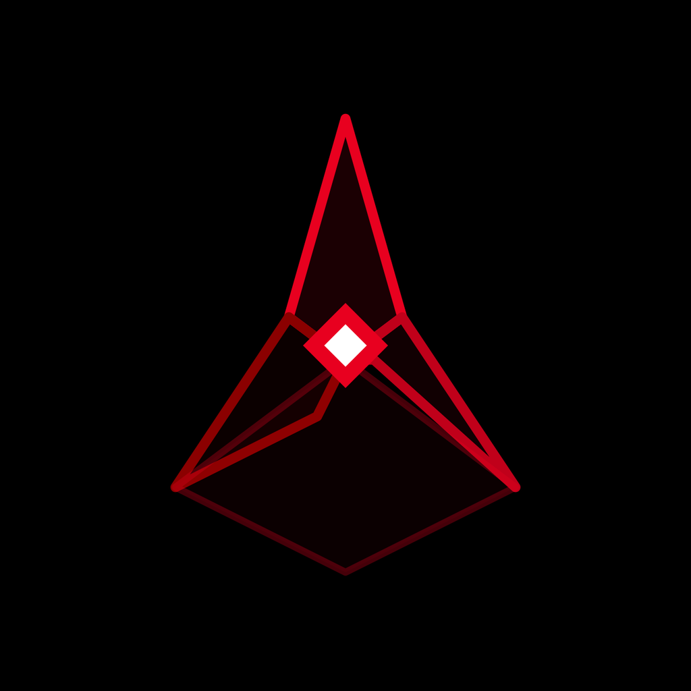
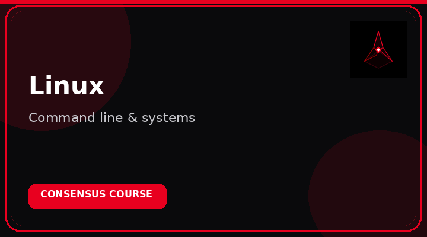
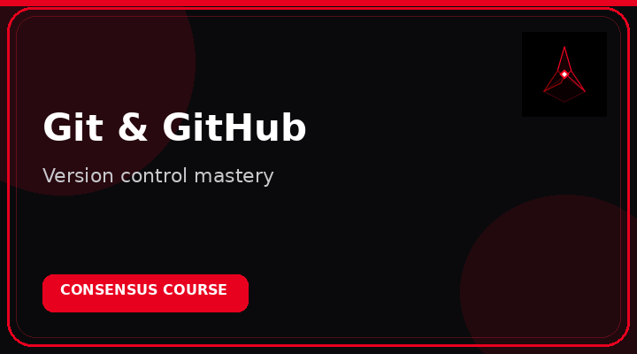
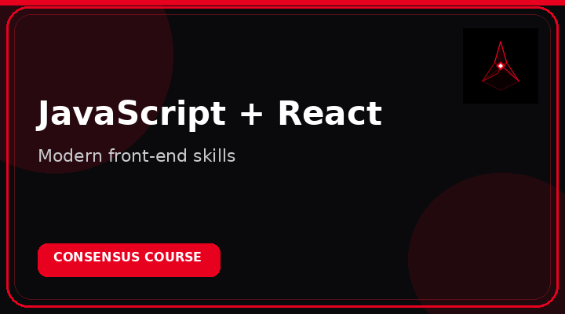
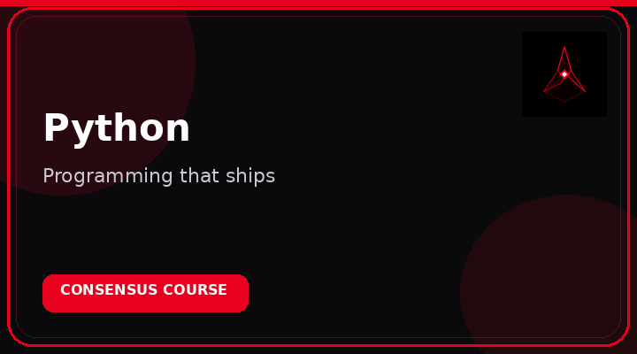

# CONSENSUS

### Intelligent Learning Platform

**A modern LMS for people who take skills seriously.**

 

---

## Learn with intent

Consensus is built around one idea:

> **You don’t just finish courses — you become capable.**

From first lesson to final credential, every step is designed for real progress.

---

## Featured courses

| | |
| :---: | :---: |
|  |  |
|  |  |
|  |  |

→ [Browse all courses](https://consensus.codes/courses)

---

## The platform

| | | | |
| :---: | :---: | :---: | :---: |
| **Courses** | **Labs** | **Exams** | **Certificates** |
| Structured learning | Hands-on practice | Measure skill | Share proof |

---

## Skills

---

### [Launch Consensus →](https://consensus.codes)

[Create account](https://consensus.codes/signup) · [Courses](https://consensus.codes/courses) · [Labs](https://consensus.codes/labs)

 

**Learn. Build. Reach Consensus.**

