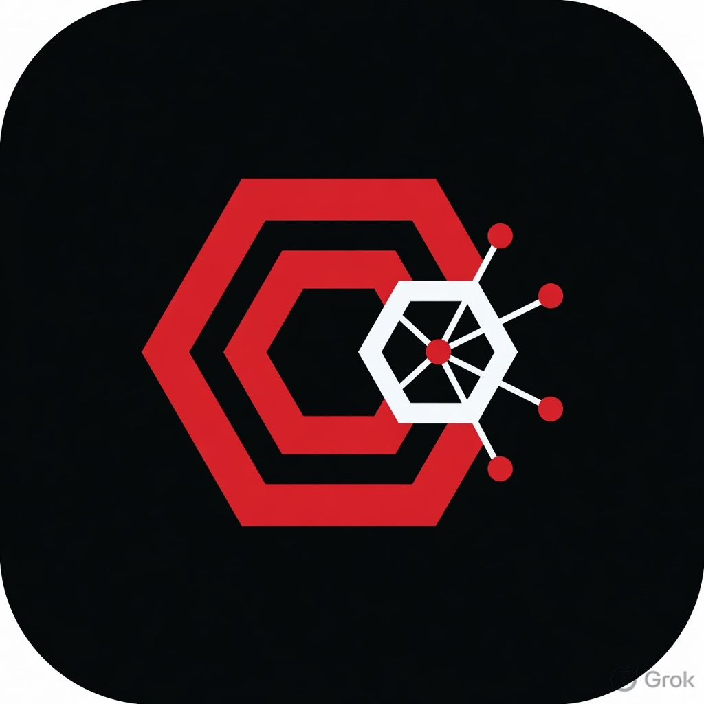
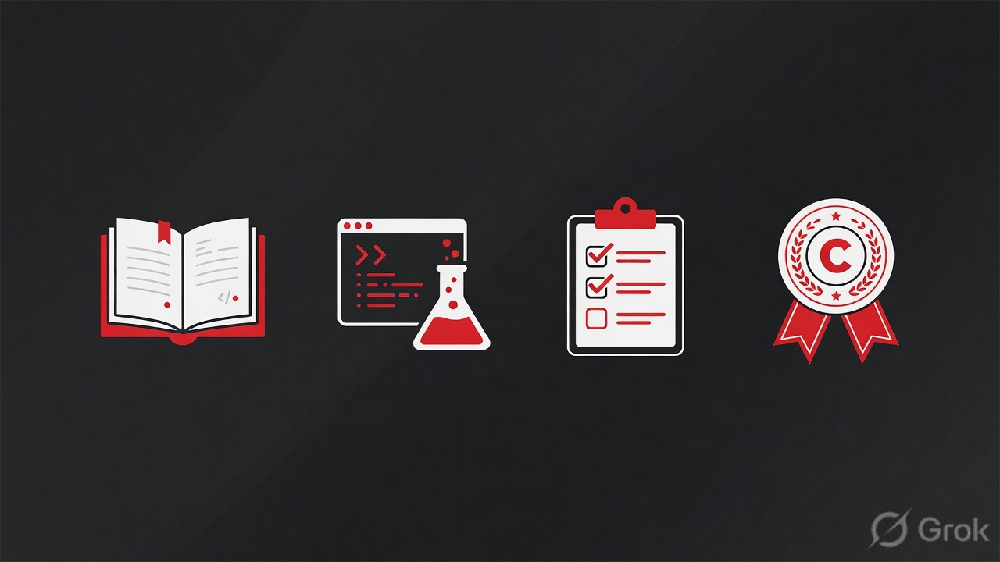

# CONSENSUS

### Intelligent Learning Platform

**A modern LMS for people who take skills seriously.**

 

---

## A better way to learn tech

Consensus is a premium online learning platform designed around one idea:

> **You don’t just complete courses — you become capable.**

Every part of the experience is built to take you from understanding → practice → proof.

---

### Four pillars of the platform

| Pillar | What it means for you |
| :--- | :--- |
| **Courses** | Structured, high-quality lessons that respect your time |
| **Labs** | Hands-on practice so skills become real |
| **Exams** | Honest assessment of what you’ve actually learned |
| **Certificates** | Credentials that reflect genuine completion |

---

## Featured learning areas

**Linux** · **Git & GitHub** · **JavaScript + React** · **Python** · **DevOps** · **System Design**

Paths for beginners and builders who want depth — not noise.

→ [Browse courses](https://consensus.codes/courses)

---

## Designed for real progress

- **Clean learning UI** — stay focused on the material  
- **Self-paced flow** — learn on your schedule  
- **Guided learning paths** — multi-course journeys with a clear destination  
- **Progress tracking** — always know where you are  
- **Shareable achievements** — certificates you can verify and show  

---

## Start learning

### [Launch Consensus →](https://consensus.codes)

[Create account](https://consensus.codes/signup) · [View courses](https://consensus.codes/courses) · [Explore labs](https://consensus.codes/labs)

 

**Learn. Build. Reach Consensus.**

